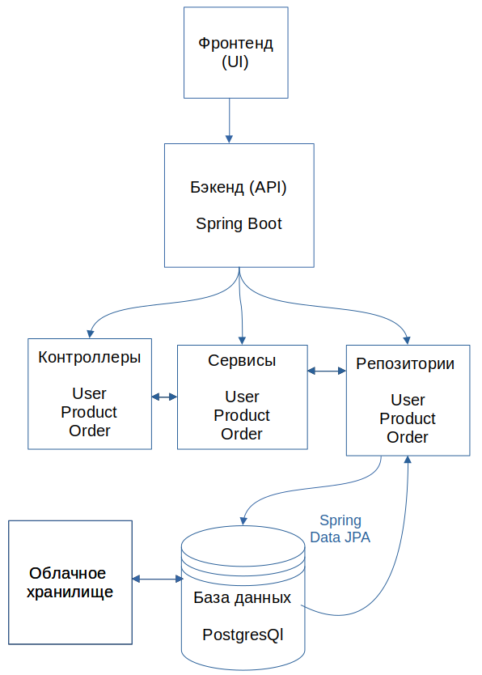

# Проект интернет-магазина

## Описание

Этот проект реализует прототип интернет-магазина с использованием `Spring Boot` и `PostgreSQL`.

## Выбор базы данных

Реляционная база данных: `PostgreSQL`
    
Плюсы:

* Свободный доступ
* Строгое соблюдение `ACID`.
* Хорошо подходит для структурированных данных с сложными отношениями.
* Можно без потерь перенести данные из другой СУБД
* Можно установить на любую платформу

## Структура проекта

## Хранение медиаконтена

Медиаконтент для веб-приложений может храниться в различных хранилищах, включая облачные сервисы. Некоторые популярные примеры облачных хранилищ, доступных в РФ:

- **VK cloud**
- **Yandex cloud**

    

## Стек технологий

- **Backend:** Java, Spring Framework
- **База данных:** PostgreSQL
- **Инструмент сборки проекта:** Maven
- **Зависимости:** Lombok, Spring Data JPA (Hibernate), Spring Web, PostgreSQL

